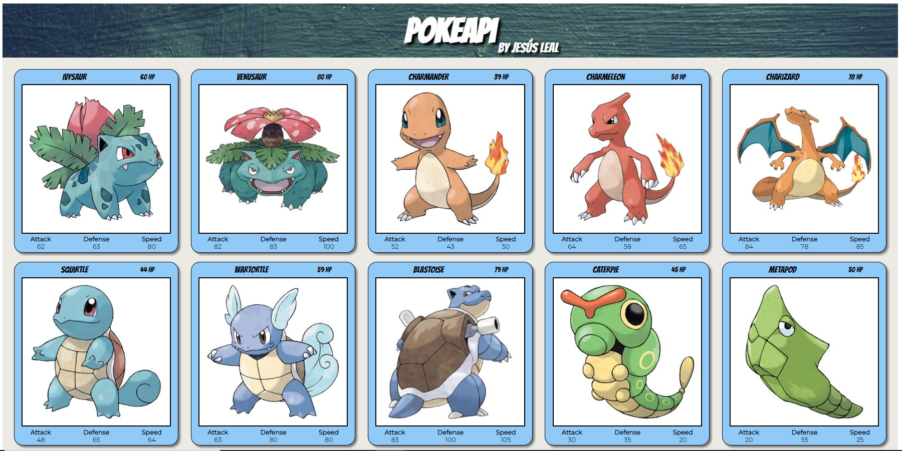

### Bootcamp Full Stack Developer - Upgrade Hub
## Proyecto JavaScript - PokeProject
---

Página Web creada utilizando HTML5, SCSS (CSS) y JavaScript como proyecto del segundo módulo del bootcamp.

La idea es crear una web con la lista de los primeros 150 Pokemons, los de la 1ª generación. Para ello se utiliza la [PokeAPI](https://pokeapi.co/), lo que requiere realizar una petición para recuperar los pokemons y manejar la asincronía para pintar cada uno de ellos de manera dinámica.

* Se puede ver en: [https://jesusleal-pokeapi.netlify.app/](https://jesusleal-pokeapi.netlify.app/)

* Todo el código fuente está disponible en el repositorio:
[https://github.com/portfolio-jesus-leal/proyecto-javascript-pokeproject-jesus-leal](https://github.com/portfolio-jesus-leal/proyecto-javascript-pokeproject-jesus-leal)

...

**Estructura:**

Componentes creados:
- index.html
- index.js
- styles/styles.scss
- styles/style.css (Generado a partir de styles.scss)
- images/*
